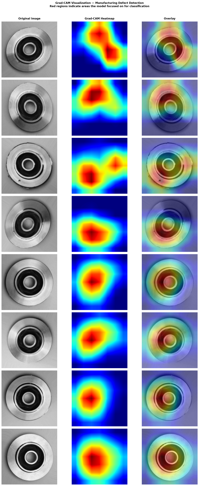
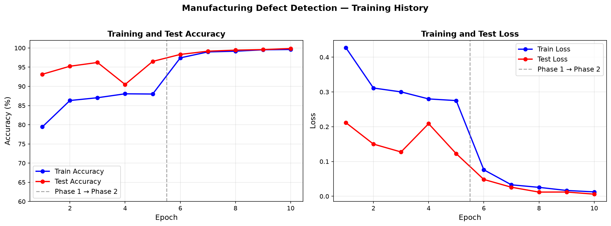
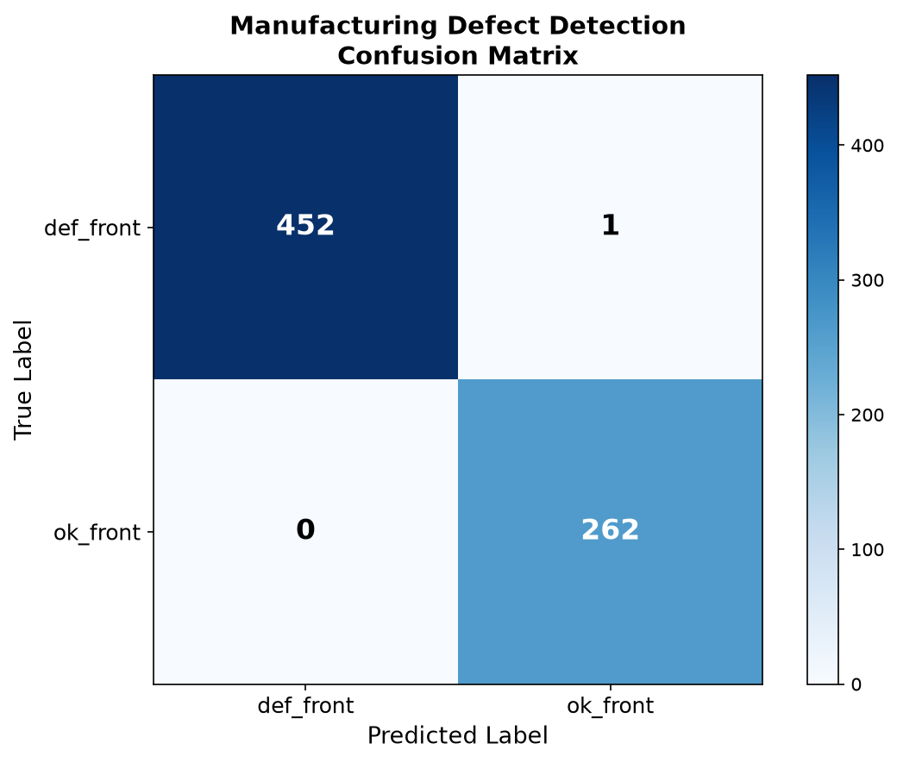

# Manufacturing Defect Detection System

An AI-powered computer vision system that automatically detects surface defects in manufactured casting products using transfer learning on ResNet18.

Built to demonstrate production-grade ML engineering for manufacturing quality inspection use cases — directly applicable to shop floor AI deployments in industrial environments.

---

## Results

| Metric | Score |
|---|---|
| Overall Accuracy | **99.86%** |
| Precision | **99.86%** |
| Recall | **99.86%** |
| F1 Score | **99.86%** |
| Defect Recall | **99.78%** |
| Test Samples | 715 images |

Out of 453 defective parts in the test set, the model missed only 1 — critical performance for manufacturing quality control where missing a defect has real downstream costs.

---

## Demo



*Grad-CAM heatmaps showing where the model focuses attention. Defective parts show distributed hotspots across surface anomalies. Normal parts show consistent central focus on the casting hub.*



*Two-phase training curve — frozen backbone classifier training followed by full network fine-tuning.*



*Confusion matrix on 715 held-out test images.*

---

## Business Context

In a manufacturing environment this system replaces manual visual inspection on the production line:

- **Camera captures image** of each casting as it moves down the line
- **Model classifies** the part as DEFECTIVE or NORMAL in milliseconds
- **Grad-CAM overlay** shows the quality engineer exactly WHERE the defect is located
- **REST API** integrates with existing MES, SCADA, or quality management systems
- **Batch endpoint** supports end-of-shift quality reporting

**Manufacturing impact:**
- 99.78% of defective parts caught before shipping
- 100% of normal parts correctly cleared — no false alarms stopping the line
- Latency suitable for real-time production line deployment

---

## Architecture
casting image
↓
FastAPI REST endpoint (/predict)
↓
Image preprocessing (resize 224x224, normalize)
↓
ResNet18 — fine-tuned classifier
↓
Prediction + confidence score
↓
Grad-CAM heatmap generation
↓
JSON response with classification,
confidence, recommendation,
and base64 Grad-CAM overlay

---

## Tech Stack

- **Model:** ResNet18 (transfer learning) — PyTorch
- **Training:** Two-phase fine-tuning — frozen backbone then full network
- **Explainability:** Grad-CAM on final convolutional layer
- **API:** FastAPI with automatic Swagger documentation
- **Containerization:** Docker
- **CI/CD:** GitHub Actions — automated testing and Docker build on every push
- **Dataset:** Real-Life Industrial Dataset of Casting Products (Kaggle)

---

## Project Structure
defect-detection/
├── src/
│ ├── data_prep.py # Dataset loading, augmentation, DataLoaders
│ ├── model.py # ResNet18 architecture and transfer learning
│ ├── train.py # Two-phase training loop with checkpointing
│ ├── evaluate.py # Metrics, confusion matrix, visualizations
│ └── gradcam.py # Grad-CAM implementation and visualization
├── api/
│ └── main.py # FastAPI REST endpoints
├── tests/
│ └── test_api.py # Automated test suite
├── outputs/ # Generated visualizations
├── models/ # Saved model weights
├── Dockerfile # Container definition
├── requirements.txt # Python dependencies
└── .github/workflows/ # CI/CD pipeline
└── ci.yml

---

## API Endpoints

| Method | Endpoint | Description |
|---|---|---|
| GET | `/` | Health check |
| GET | `/health` | Detailed health status |
| POST | `/predict` | Classify single casting image |
| POST | `/predict/batch-summary` | Batch analysis summary |
| GET | `/model/info` | Model architecture and performance |

### Sample Request

```bash
curl -X POST "http://localhost:8000/predict" \
     -H "accept: application/json" \
     -H "Content-Type: multipart/form-data" \
     -F "file=@casting_image.jpeg;type=image/jpeg"
```

### Sample Response

```json
{
  "prediction": "DEFECTIVE",
  "confidence": 99.87,
  "defective_probability": 99.87,
  "normal_probability": 0.13,
  "latency_ms": 842.3,
  "gradcam_overlay": "base64_encoded_png...",
  "model_version": "ResNet18-v1.0",
  "recommendation": "REJECT — High confidence defect detected. Remove from production line immediately."
}
```

---

## Quick Start

### Run locally

```bash
# Clone the repository
git clone https://github.com/PiotrWarchol/defect-detection.git
cd defect-detection

# Install dependencies
pip install -r requirements.txt

# Start the API
python api/main.py

# Open interactive docs
# http://localhost:8000/docs
```

### Run with Docker

```bash
# Build the image
docker build -t defect-detection .

# Run the container
docker run -p 8000:8000 defect-detection

# API available at http://localhost:8000
```

---

## Model Training

### Dataset
- **Source:** Real-Life Industrial Dataset of Casting Products
- **Training samples:** 6,633 casting images
- **Test samples:** 715 casting images
- **Classes:** def_front (defective), ok_front (normal)
- **Class distribution:** 56.7% defective, 43.3% normal

### Training Approach

**Phase 1 — Classifier head only (5 epochs)**
- ResNet18 backbone frozen
- Only custom classifier head trained
- Learning rate: 0.001
- Result: 96.5% test accuracy

**Phase 2 — Full fine-tuning (5 epochs)**
- All 11.3M parameters unfrozen
- Lower learning rate: 0.0001
- Result: 99.86% test accuracy

### Training Results by Epoch

| Phase | Epoch | Train Acc | Test Acc |
|---|---|---|---|
| 1 | 1 | 79.4% | 93.1% |
| 1 | 5 | 88.0% | 96.5% |
| 2 | 1 | 97.4% | 98.3% |
| 2 | 5 | 99.6% | 99.9% |

---

## Why Defect Recall Matters Most

In manufacturing quality control, two types of errors have very different costs:

- **Missing a defect (false negative):** Defective part ships to customer → warranty claims, recalls, reputation damage, safety risk
- **False alarm (false positive):** Normal part flagged for re-inspection → minor production delay

This system achieves **99.78% defect recall** — optimized for the high-cost error. Of 453 defective parts in the test set, only 1 was missed.

---

## Explainability — Grad-CAM

Grad-CAM (Gradient-weighted Class Activation Mapping) generates visual explanations for model predictions by highlighting which regions of the input image were most important for the classification decision.

For manufacturing applications this means:
- Quality engineers can **see where the defect was detected** rather than trusting a black box
- Patterns in Grad-CAM attention can **identify systematic defect locations** in the manufacturing process
- Explainability supports **regulatory compliance** in quality management systems

---

## Related Projects

- [Baseball RAG Assistant](https://github.com/PiotrWarchol/baseball-rag-assistant) — Production RAG pipeline with LangChain, ChromaDB, and Azure deployment
- [Tool Review Sentiment Classifier](https://github.com/PiotrWarchol/tool-sentiment-classifier) — DistilBERT fine-tuning achieving 89.5% accuracy on 50,000 reviews

---

## Author

**Piotr Warchol**
Software Engineer | MS Computer Science — AI Concentration
[GitHub](https://github.com/PiotrWarchol)